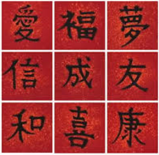
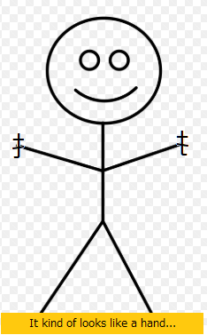

[フリガナ版/Furigana Version](assets/漢字の勉強2furigana.pdf)

  

みんなは、日本語が難しくて<ruby>特<rt>とく</rt>別<rt>べつ</rt></ruby>な書き方あることをもう知っているはずです。漢字を勉強することがあんまり大変じゃなくて簡単になる人はいます。
しかし、漢字を勉強することが苦手になる人もいます。
諦めないためには、日本語の勉強を楽しくするためにも、このサイトの中に少し助言が書いてあります。

By now, you should already know that Japanese uses a unique and difficult writing system. For some people, studying kanji is not so difficult and is easy. However, for others, studying kanji is problematic.

In order to encourage not giving up and even make learning kanji fun, this site contains some advice for learning kanji.

このセクションは、漢字を学ぶことに役に立つこととして、三つの部分で構成されています。
  * 一つ目は、部首の説明したり、例えを見せたりします。
  * 二つ目は、少しの初級漢字を面白い話で覚えやすく教えされます。
  * 三つ目は、自由に学びたい漢字を上述のヒントを使って勉強するために、空白なフォームがあります。

This section is organized into three parts in order to be helpful to kanji learning.
  * First, particles are explained and examples given, among other things.
  * Second, some of the beginner kanji are taught using funny stories that make them easy to remember.
  * Third, a blank form giving you the opportunity to use the above mentioned tips to study a kanji you wish to learn is available.

### 一つ目：部首について
### Part 1: Particles

漢字について、「レゴ」というおもちゃのような作り方があります。つまり、各々沢山でいろいろな部分から、完全の概念がある絵文字を取り合わせます。意味を表せても、発音を決めても、この「部首」という部分では、役に立つ説明や面白い話を作って漢字が覚えやすくなります。

Japanese Kanji are made using a method similar to toy Legos. In other words, each one is made from many different parts that, when assembled together, form pictographs representing one complete concept. Whether they represent the meaning or whether they determine the pronunciation, these parts, known as radicals, if used to make useful explanations or funny stories, can make a kanji easy to remember.

  

氵：「さんずい」という部首は、水に関するという意味です。それで、さんずいで作った漢字は、ほとんど、水についての意味になります。話を作りたかったら、水を使ってください。それが分かったら、漢字の意味を覚えることができます。

The radical called "sanzui" carries a meaning relating to the kanji 「水」(water). Therefore, Kanji written with this radical usually have a "water"-associated meaning. When creating a story for this Kanji, use water in it. Understanding this, you can remember the kanji's meaning.

  

扌：「てへん」という部首は、手に関するという意味です。それで、てへんで作った漢字は、ほとんど、手についての意味になります。話を作りたかったら、手を使ってください。それが分かったら、漢字の意味を覚えることができます。

The radical called "tehen" carries a meaning relating to the kanji 「手」(hand).Therefore,Kanji written with this radical usually have a "hand"-associated meaning.When creating a story for this Kanji, use "hand" in it.Understanding this, you can remember the kanji's meaning.

言：「ごんべん」という部首は、言うことに関する意味です。それで、ごんべんで作った漢字は、ほとんど、言語や話すについての意味になります。話を作りたかったら、会話や言動を使ってください。それが分かったら、漢字の意味を覚えることができます。

The radical called "gonben" carries a meaning relating to the word「言う」(to say). Therefore, Kanji written with this radical usually have a "language" or "speaking"-associated meaning. When creating a story for this Kanji, use "conversation" or "speech" in it. Understanding this, you can remember the kanji's meaning.

木：「きへん」という部首は、木に関するという意味です。それで、きへんで作った漢字は、ほとんど、木についての意味になります。話を作りたかったら、木や木材を使ってください。それが分かったら、漢字の意味を覚えることができます。

The radical called "kihen" carries a meaning relating to the kanji 「木」(tree). Therefore, Kanji written with this radical usually have a "tree"-associated meaning. When creating a story for this Kanji, use "tree" or "wood" in it. Understanding this, you can remember the kanji's meaning.

土：「つちへん」という部首は、土に関するという意味です。それで、つちへんで作った漢字は、ほとんど、土や地面についての意味になります。話を作りたかったら、土や地面を使ってください。それが分かったら、漢字の意味を覚えることができます。

The radical called "tsuchihen" carries a meaning relating to the kanji 「土」(soil). Therefore, Kanji written with this radical usually have a "earth" or "ground"-associated meaning. When creating a story for this Kanji, use "earth" or "ground" in it. Understanding this, you can remember the kanji's meaning.

### 二つ目：漢字を覚えやすい話
### Part 2: Stories to remember kanji easily

語:  
部首：言、五、口  
音読み：ゴ  
英語で意味：Language

口で五つの別の言語で話している五人がいます。みんなは自分の言語を、鼻じゃなくて、指じゃなくて、口で英語の「go」と言っていますが、分かり合えないので、誰もどこも行きませんでしょう。

Imagine there are 5 people speaking 5 different LANGUAGES with their MOUTHS. Everyone is saying the word "GO" with their MOUTHS (not with their nose nor with their fingers) in their own LANGUAGE, but since no one can understand each other, no one will GO anywhere.

泣：  
部首：氵、立  
音読み：キュウ  
英語で意味：Cry

毎回、私が立ったら、すぐに水が目から流れます。早々に泣くことができます(塩が嫌いだから、涙が流れません）。どうして立って泣きますか？若い頃、ある時、立って「キュート」ペットの兎を足で踏み潰して殺してしまいました。

Every time I STAND up, WATER, immediately starts to fall from my eyes. I begin to CRY right away(I don't like salt, so I don't cry tears). Why do I CRY when I STAND? It's because when I was young, my CUte pet rabbit was crushed to death under my foot one time when I STOOD up.

拾：  
部首：扌、合  
音読み：シュウ  
英語で意味：Pick up

ね、ね！このたった今買った「シューズ」を見て！見たときに手で拾った（普段、犬のように口でものを拾うけど今回、靴がすごくきれいだから手を使った）。私に合ってるでしょうか？手にも合ってるじゃない？

Look at this pair of SHOEs I just bought! When I saw them, I PICKED them UP with my HAND (I usually PICK things UP with my mouth like a dog, but this time I used my HAND because these SHOEs are really nice).Don't they SUIT me well? Don't they SUIT my HANDs perfectly?

品  
部首：口  
音読み：ヒン  
英語で意味：goods, products  

男の人に沢山の口があったら食べる品物が増える必要があると皆が知っています。三つの口がある男の人を想像してください。三つの胃腸もあるでしょう。その三つの口がある男の人は私やあなたに比べて三倍の品物を食べることが必要です！

Everyone knows that the more MOUTHS a man has, the more HE Needs edible GOODS and PRODUCTS. Imagine a man has THREE MOUTHS. He probably has three stomachs too. This man with THREE MOUTHS, HE Needs to eat three times as many edible GOODS as you and me!

### 三つ目：話を作るためのフォーム
### Part 3: Form for making stories

[フォームをダウンロード/Download form (PDF)](assets/漢字の勉強-BLANK_FORM.pdf)
