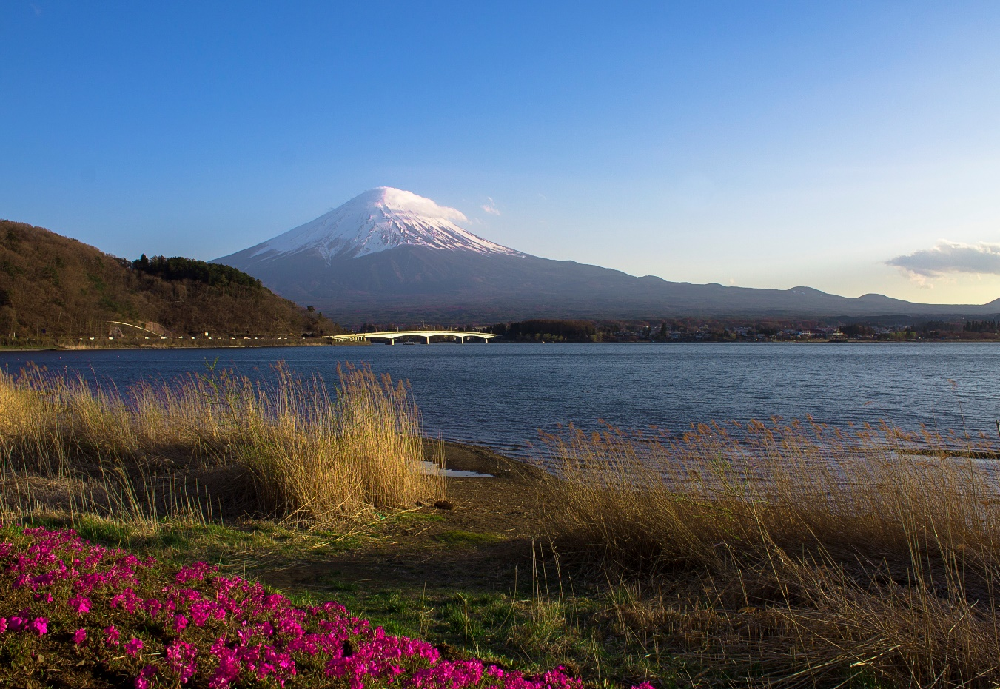
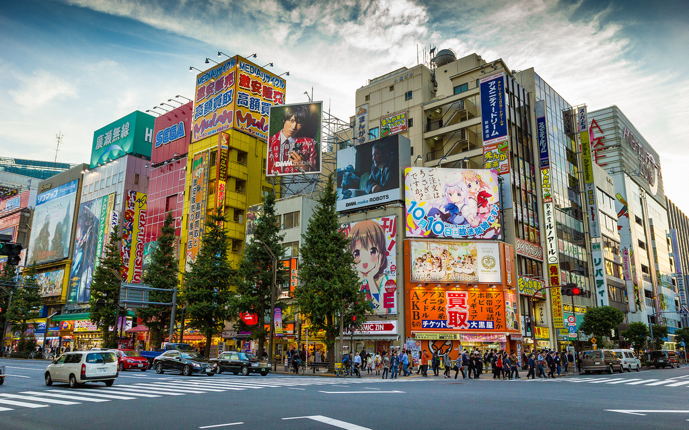
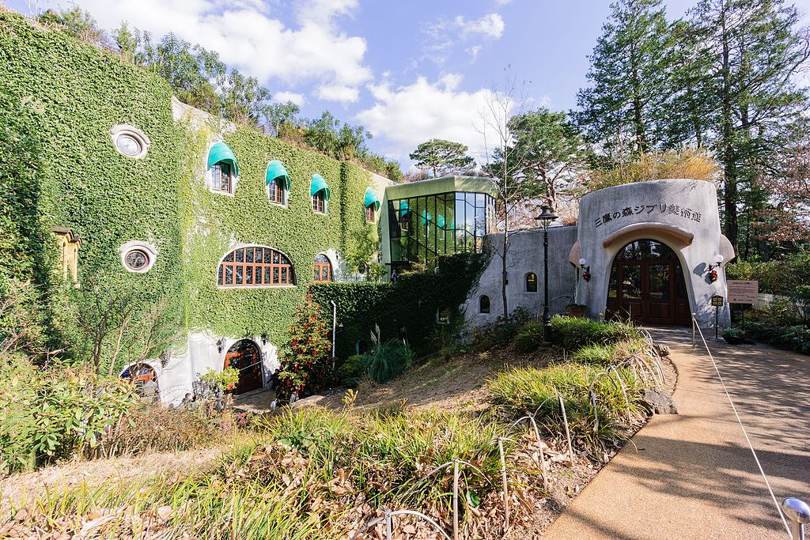
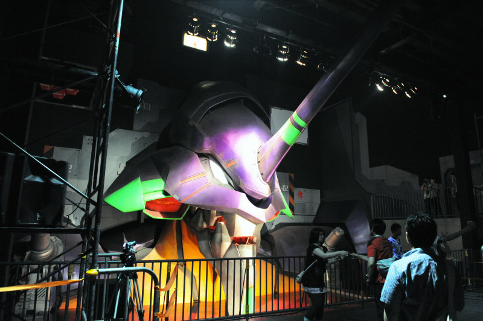
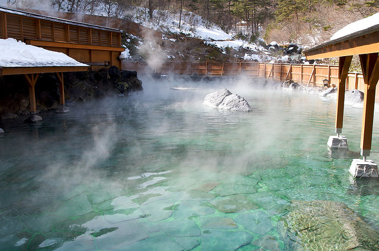
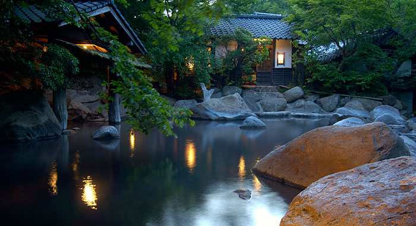
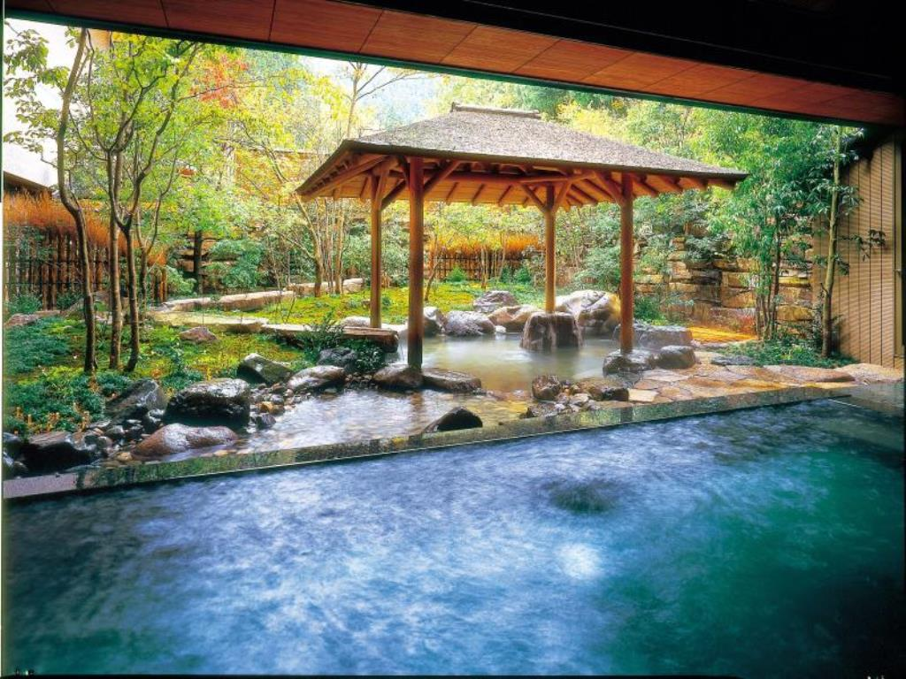
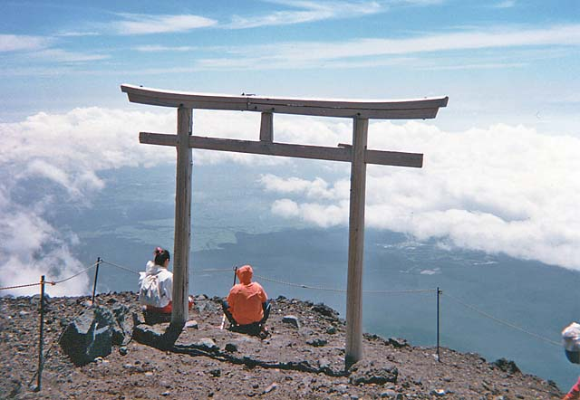
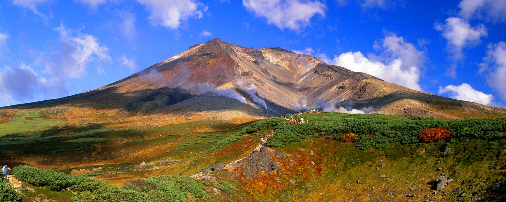
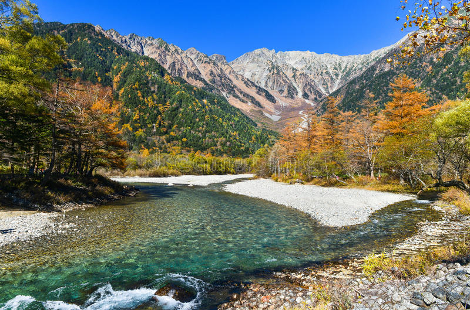

[ダウンロード/Download](assets/travel_japan.pdf)

  

日本は素晴らしい国です、でも、最初の日本旅行ですべてを見るのは無理です、あなたの旅行の時間は足りないんです、だからあなたの興味に応じて最高の場所を知ることはとても便利ですね。
日本の旅はすぐ始まります、<ruby>興味<rt>きょうみ</rt></ruby>があるものを<ruby>選<rt>えら</rt></ruby>んでください。

### [アニメと<ruby>漫画<rt>まんが</rt></ruby>](#アニメと漫画)

### [<ruby>温泉<rt>おんせん</rt></ruby>](#温泉)

### [ハイキング](#hiking)

### [<ruby>祭<rt>まつり</rt></ruby>](#祭)

### [<ruby>日本料理<rt>にほんりょうり</rt></ruby>](#日本料理)

## アニメと<ruby>漫画<rt>まんが</rt></ruby>

  

#### 1. <ruby>秋葉原<rt>あきはばら</rt></ruby>、東京

かつての<ruby>地方神社<rt>ちほうじんじゃ</rt></ruby>から秋葉と<ruby>呼<rt>よ</rt></ruby>ばれた秋葉原は、東京の中心にある多くのエレクトロニクスショップで有名な地区です。 近年、秋葉原は日本のオタク文化の中心地として<ruby>認知<rt>にんち</rt></ruby>され、アニメやマンガを<ruby>扱<rt>あつか</rt></ruby>う多くの<ruby>店舗<rt>てんぽ</rt></ruby>や<ruby>施設<rt>しせつ</rt></ruby>がこの地区の<ruby>電子店舗<rt>でんしてんぽ</rt></ruby>に<ruby>散在<rt>さんざい</rt></ruby>しています。<ruby>日曜日<rp>(</rp><rt>にちようび</rt><rp>)</rp></ruby>は13<ruby>時<rp>(</rp><rt>じ</rt><rp>)</rp></ruby>から18<ruby>時<rp>(</rp><rt>じ</rt><rp>)</rp></ruby>まで（10<ruby>月<rp>(</rp><rt>がつ</rt><rp>)</rp><ruby>から3<ruby>月<rp>(</rp><rt>がつ</rt><rp>)</rp><ruby>は17時まで地区の<ruby>大通<rp>(</rp><rt>おおどお</rt><rp>)</rp></ruby>りは<ruby>自動車交通<rp>(</rp><rt>じどうしゃこうつう</rt><rp>)</rp></ruby>が<ruby>閉鎖<rp>(</rp><rt>へいさ</rt><rp>)</rp>されます。

Akihabara also called Akiba after a former local shrine, is a district in central Tokyo that is famous for its many electronics shops. In more recent years, Akihabara has gained recognition as the center of Japan's otaku (diehard fan) culture, and many shops and establishments devoted to anime and manga are now dispersed among the electronic stores in the district. On Sundays, Chuo Dori, the main street through the district, is closed to car traffic from 13:00 to 18:00 (until 17:00 from October through March).

  

#### 2. <ruby>三鷹<rp>(</rp><rt>みたか</rt><rp>)</rp></ruby>の森ジブリ<ruby>美術館<rp>(</rp><rt>びじゅつかん</rt><rp>)</rp></ruby>

 ジブリ美術館は、<ruby>世界的<rp>(</rp><rt>せかいてき</rt><rp>)</rp></ruby>に<ruby>有名<rp>(</rp><rt>ゆうめい</rt><rp>)</rp></ruby>なスタジオジブリのアニメーションと美術館です。<ruby>宮崎駿<rp>(</rp><rt>みやざきはやお</rt><rp>)</rp></ruby>の手で<ruby>率<rp>(</rp><rt>ひき</rt><rp>)</rp></ruby>いられ 、となりのトトロ、もののけ姫、<ruby>千<rp>(</rp><rt>せん</rt><rp>)</rp></ruby>と<ruby>千尋<rp>(</rp><rt>ちひろ</rt><rp>)</rp></ruby>の<ruby>神隠<rp>(</rp><rt>かみかく</rt><rp>)</rp></ruby>し、<ruby>崖<rp>(</rp><rt>がけ</rt><rp>)</rp></ruby>の上のポニョなど世界的に<ruby>流通<rp>(</rp><rt>りゅうつう</rt><rp>)</rp></ruby>している<ruby>長編映画<rp>(</rp><rt>ちょうへんえいが</rt><rp>)</rp></ruby>を<ruby>多数制作<rp>(</rp><rt>たすうせいさく</rt><rp>)</rp>しています。

 <ruby>東京都心<rp>(</rp><rt>としん</rt><rp>)</rp></ruby>のすぐそばにある三鷹に<ruby>位置<rp>(</rp><rt>いち</rt><rp>)</rp></ruby>し、映画のファンには<ruby>必見<rp>(</rp><rt>ひっけん</rt><rp>)</rp></ruby>です。 美術館自体自体はスタジオの映画の<ruby>独特<rp>(</rp><rt>どくとく</rt><rp>)</rp></ruby>のスタイルでデザインされており、その上で、「天空の城ラピュタ」からの実物大のロボットを含む、映画の有名なキャラクタが見つけます。
 1階にはアニメーションの歴史と技術が展示されていて、スタジオジブリの美術館に限られている短い映画を展示する小さな劇場があります。 2階には特別な仮設展があります。 美術館にはカフェや子供の遊び場や屋上庭園やギフトショップもあります。

 The Ghibli Museum, is the animation and art museum of the worldwide acclaimed Studio Ghibli. Leaded by the hand of Hayao Miyazaki, they have produced many feature length films with worldwide distribution such as My Neighbor Totoro, Princess Mononoke, Spirited Away and Ponyo on the Cliff by the Sea.

 Located in Mitaka, just outside of central Tokyo, the museum is a must-see for fans of the films. The museum itself is designed in the distinct style of the studio's films, and many of their famous characters are there, including a life-sized robot from "Castle in the Sky" in the rooftop garden.

 The first floor of the museum exhibits the history and techniques of animation and has as a small theater which shows short movies by Studio Ghibli that are exclusive to the museum. The second floor houses special temporary exhibitions. The museum also has a cafe, children's play area, a rooftop garden and a gift shop.  
 [www.ghibli-museum.jp](www.ghibli-museum.jp)

 

   
 

#### 3. <ruby>富士<rp>(</rp><rt>ふじ</rt><rp>)</rp>急<rp>(</rp><rt>きゅう</rt><rp>)</rp></ruby>ハイランド、<ruby>進撃<rp>(</rp><rt>しんげき</rt><rp>)</rp></ruby>の<ruby>巨人<rp>(</rp><rt>きょじん</rt><rp>)</rp></ruby>THE RIDE とEVANGELION WORLD, <ruby>河口湖町<rp>(</rp><rt>かわぐちこまち</rt><rp>)</rp></ruby>

富士急ハイランドは日本で<ruby>最<rp>(</rp><rt>もっと</rt><rp>)</rp></ruby>も人気がある遊園地の一つで、富士山のふもとにある富士<ruby>五湖<rp>(</rp><rt>ごこ</rt><rp>)</rp>地域<rp>(</rp><rt>ちいき</rt><rp>)</rp></ruby>に<ruby>位置<rp>(</rp><rt>いち</rt><rp>)</rp></ruby>します。スリリング<ruby>記録破<rp>(</rp><rt>きろくやぶ</rt><rp>)</rp></ruby>りローラーコースターと<ruby>精巧<rp>(</rp><rt>せいこう</rt><rp>)</rp></ruby>なアニメテーマにした乗り物とアトラクションで最もよく知られています。 この遊園地は、テーマパークのエンターテイメントの<ruby>最前線<rp>(</rp><rt>さいぜんせん</rt><rp>)</rp></ruby>に<ruby>挑戦<rp>(</rp><rt>ちょうせん</rt><rp>)</rp></ruby>しており、ギネス世界記録を破るローラーコースターと新しいアトラクションを<ruby>常<rp>(</rp><rt>つね</rt><rp>)</rp></ruby>に建てています。

Fuji-Q Highland (富士急) is one of Japan's most popular amusement parks, located in the Fuji Five Lake region at the foot of Mount Fuji. It is best known for its thrilling, record-breaking roller coasters and elaborate, anime- themed rides and attractions like THE RIDE featuring attack on titan characters and EVANGELION WORLD. The park strives to be at the forefront of theme park entertainment, and has been constantly opening new rides and attractions, including Guinness World Record breaking roller coasters.  
[http://ｗww.fujiq.jp](http://ｗww.fujiq.jp)

他の<ruby>素晴<rp>(</rp><rt>すば</rt><rp>)</rp></ruby>らしい良い<ruby>経験<rp>(</rp><rt>けいけん</rt><rp>)</rp></ruby>

* 君の名は映画の本当の場所への<ruby>巡礼<rp>(</rp><rt>じゅんれい</rt><rp>)</rp></ruby>、東京、<ruby>飛騨<rp>(</rp><rt>ひだ</rt><rp>)</rp></ruby> <ruby>岐阜県<rp>(</rp><rt>ぎふけん</rt><rp>)</rp></ruby>  
[http://www.tofugu.com/japan/your-name-locations](http://www.tofugu.com/japan/your-name-locations)

* <ruby>京都国際<rp>(</rp><rt>きょうとこくさい</rt><rp>)</rp></ruby>マンガミュージアム  
[http://www.kyotomm.jp](http://www.kyotomm.jp)

* Anime Japan 毎年3月、東京  
[http://www.anime-japan.jp](http://www.anime-japan.jp)

* J-World、東京  
[http://bandainamco-am.co.jp/tp/j-world](http://bandainamco-am.co.jp/tp/j-world)

## <ruby>温泉<rt>おんせん</rt></ruby>

  

#### 1. <ruby>草津<rt>くさつ</rt></ruby>温泉、<ruby>群馬県<rt>ぐんまけん</rt></ruby>

草津温泉は、日本で<ruby>最<rt>もっと</rt></ruby>も<ruby>有名<rt>ゆうめい</rt></ruby>な温泉<ruby>地帯<rt>ちたい</rt></ruby>のひとつであり、<ruby>恋煩<rt>こいわずら</rt></ruby>い<ruby>以外<rt>いがい</rt></ruby>あらゆる<ruby>病気<rt>びょうき</rt></ruby>を<ruby>治療<rt>ちりょう</rt></ruby>するといわれる<ruby>高品質<rt>こうひんしつ</rt></ruby>の温泉<ruby>水<rt>みず</rt></ruby>が<ruby>大量<rt>たいりょう</rt></ruby>に<ruby>恵<rt>めぐ</rt></ruby>まれています。
<ruby>何<rt>なん</rt>世紀<rt>せいき</rt></ruby>にもわたって温泉地として知られていた草津の<ruby>名声<rt>めいせい</rt></ruby>は、1800<ruby>年代<rt>ねんだい</rt></ruby><ruby>後期<rt>こうき</rt></ruby>に<ruby>皇室<rt>こうしつ</rt></ruby>に<ruby>勤<rt>つと</rt></ruby>めたドイツの<ruby>医師<rt>いし</rt></ruby>によってさらに<ruby>拡大<rt>かくだい</rt></ruby>されました。彼は水の<ruby>健康上<rt>けんこうじょう</rt></ruby>の<ruby>利益<rt>りえき</rt></ruby>のために草津を<ruby>勧<rt>すす</rt></ruby>めました。群馬県の<ruby>山々<rt>やまやま</rt></ruby>の<ruby>標高<rt>ひょうこう</rt></ruby>1200mの草津に<ruby>位置<rt>いち</rt></ruby>し、冬にスキーがあり、<ruby>一年中<rt>いちねんじゅう</rt></ruby>ハイキングも温泉<ruby>浴<rt>よく</rt></ruby>と<ruby>組<rt>く</rt></ruby>み<ruby>合<rt>あ</rt></ruby>わせて<ruby>楽<rt>たの</rt></ruby>しむことができます。

Kusatsu Onsen is one of Japan's most famous hot spring resorts and is blessed with large volumes of high quality hot spring water said to cure every illness but lovesickness.

Well known as a hot spring resort for many centuries, Kusatsu's fame was further extended by German doctor Erwin von Baelz, who served at the imperial court in the late 1800s and recommended Kusatsu for its water's health benefits.

Kusatsu is situated at an altitude of 1200 meters above sea level in the mountains of Gunma Prefecture, and offers skiing in winter and hiking during the rest of the year to be enjoyed in combination with hot spring bathing.

[http://www.kusatsu-onsen.ne.jp/](http://www.kusatsu-onsen.ne.jp/)

  

#### 2. <ruby>黒川<rt>くろかわ</rt></ruby>温泉、<ruby>熊本県<rt>くまもとけん</rt></ruby>

黒川温泉は、<ruby>阿蘇山<rt>あそさん</rt></ruby>から<ruby>北約<rt>きたやく</rt></ruby>20km 、<ruby>九州<rt>きゅうしゅう</rt></ruby>の<ruby>真<rt>ま</rt></ruby>ん<ruby>中<rt>なか</rt></ruby>に<ruby>位置<rt>いち</rt></ruby>する日本<ruby>最高</rt>さいこう</rt></ruby>の<ruby>魅力的<rt>みりょくてき</rt></ruby>な温泉<ruby>街<rt>がい</rt></ruby>の一つです。黒川<ruby>町<rt>まち</rt></ruby>は<ruby>快適<rt>かいてき</rt></ruby>さと<ruby>伝統的<rt>でんとうてき</rt></ruby>な<ruby>雰囲気<rt>ふんいき</rt></ruby>を<ruby>維持<rt>いじ</rt></ruby>するため<ruby>努力<rt>どりょく</rt></ruby>をしています。黒川には<ruby>巨大<rt>きょだい</rt></ruby>なコンクリートホテルやネオン<ruby>広告<rt>こうこく</rt></ruby>や<ruby>騒々<rt>そうぞう</rt></ruby>しい<ruby>色<rt>いろ</rt></ruby>がないので、<ruby>他<rt>ほか</rt></ruby>のリゾートタウン町と<ruby>似<rt>に</rt></ruby>ていません。  

その<ruby>代<rt>か</rt></ruby>わりに、黒川の<ruby>街並<rt>まちな</rt></ruby>みは<ruby>自然<rt>しぜん</rt></ruby>の色や<ruby>材質<rt>ざいしつ</rt></ruby>、<ruby>木造建築物<rt>もくぞうけんちくぶつ</rt></ruby>、<ruby>土壁<rt>どへき</rt></ruby>、<ruby>石<rt>いし</rt></ruby>の<ruby>階段<rt>かいだん</rt></ruby>、川が<ruby>流<rt>なが</rt></ruby>れているおきます。<ruby>森林地帯<rt>しんりんちたい</rt></ruby>の<ruby>谷<rt>たに</rt></ruby>に位置する町の<ruby>中心部<rt>ちゅうしんぶ</rt></ruby>は<ruby>徒歩<rt>とほ</rt></ruby>で<ruby>探索<rt>たんさく</rt></ruby>しやすいですが、<ruby>中央<rt>ちゅうおう</rt></ruby>に位置しない<ruby>少数<rt>しょうすう</rt></ruby>の<ruby>旅館<rt>りょかん</rt></ruby>は<ruby>例外<rt>れいがい</rt></ruby>です。

Kurokawa Onsen is one of Japan's most attractive hot springtowns, located in the middle of Kyushu about 20 kilometers north of Mount Aso. Well coordinated efforts by the town to maintain a pleasant, traditional atmosphere have kept Kurokawa free of the massive concrete hotels, neon advertisements and loud colors that are encountered in many of Japan's other resort towns.

Instead, Kurokawa's townscape is dominated by natural colors and materials, wooden buildings, earthen walls, stone stairs and a river flowing through. The town center, located in a forested valley, is easily explored on foot, except for a few ryokan which are located less centrally.

[www.yamamizuki.com](www.yamamizuki.com)

  

#### 3.	<ruby>城崎<rt>きのさき</rt></ruby>温泉、<ruby>兵庫<rt>ひょうご</rt>県

<ruby>伝説<rt>でんせつ</rt></ruby>によると、城崎の<ruby>沼地<rt>ぬまち</rt></ruby>でコウノトリは<ruby>傷<rt>きず</rt></ruby>を<ruby>治癒<rt>ちゆ</rt></ruby>するために<ruby>浴<rt>あ</rt></ruby>びたということです。 その<ruby>後<rt>あと</rt></ruby>、この<ruby>場所<rt>ばしょ</rt></ruby>に<ruby>癒<rt>いや</rt></ruby>しの水を<ruby>利用<rt>りよう</rt></ruby>するために<ruby>色々<rt>いろいろ</rt></ruby>な<ruby>浴場<rt>よくじょう</rt></ruby>が<ruby>建<rt>た</rt></ruby>てられました。 それ<ruby>以来<rt>いらい</rt></ruby>、<ruby>関西<rt>かんさい</rt></ruby>で城崎がトップの温泉地になっています。
<ruby>現在<rt>げんざい</rt></ruby>、このエリアに<ruby>数多<rt>かずおお</rt></ruby>く温泉<ruby>旅館<rt>りょかん</rt></ruby>があります、しかし、<ruby>本当<rt>ほんとう</rt></ruby>の<ruby>観光<rt>かんこう</rt></ruby>スポットは7つの<ruby>大浴場<rt>だいよくじょう</rt></ruby>です。 <ruby>街中<rt>まちなか</rt></ruby>には、<ruby>美<rt>うつく</rt></ruby>しい<ruby>足湯<rt>あしゆ</rt></ruby>と<ruby>噴水<rt>ふんすい</rt></ruby>も<ruby>散在<rt>さんざい</rt></ruby>しています。

Legend has it that storks would bathe in the marshes of Kinosaki to heal their wounds. Later, bath houses were built over these very sites to take advantage of the healing waters. Since then Kinosaki has become a top onsen destination in the Kansai region.
Nowadays there are numerous ryokan in the area, all with their own baths, but the real draw to Kinosaki are its seven public bath houses (sotoyu). Also scattered throughout town are some beautiful foot baths (ashiyu) and fountains.

他の素晴らしい<ruby>経験<rt>けいけん</rt></ruby>

* 箱根温泉、神奈川県  
  [http://www.hakone.or.jp/en/](http://www.hakone.or.jp/en/)

* 由布院温泉、大分県  
  [yufuin-ublhotel.jp/en/](yufuin-ublhotel.jp/en/)

* 別府温泉  
  [http://www.gokuraku-jigoku-beppu.com](http://www.gokuraku-jigoku-beppu.com)

* 登別温泉、北海道  
  [http://www.takimotokan.co.jp/english/](http://www.takimotokan.co.jp/english/)

* 道後温泉、松山市、愛媛県  
  [dogo.jp](dogo.jp)

## ハイキング

  

#### 1. <ruby>富士山<rt>ふじさん</rt></ruby>、<ruby>山梨県<rt>やまなしけん</rt></ruby>と<ruby>静岡県<rt>しずおかけん</rt></ruby>、7月から9月10日まで

日本で<ruby>最<rt>もっと</rt></ruby>も<ruby>高<rt>たか</rt></ruby>く、最も<ruby>有名<rt>ゆうめい</rt></ruby>な山、富士山を<ruby>登<rt>のぼ</rt></ruby>るのは<ruby>一生<rt>いっしょう</rt></ruby>の<ruby>思<rt>おも</rt></ruby>い<ruby>出<rt>で</rt></ruby>になるでしょう。 山は<ruby>遠<rt>とお</rt></ruby>くから<ruby>魅力的<rt>みりょくてき</rt></ruby>に<ruby>見<rt>み</rt></ruby>えるかもしれませんが、<ruby>晴<rt>は</rt></ruby>れた日の<ruby>景色<rt>けしき</rt></ruby>と、<ruby>世界中<rt>せかいじゅう</rt></ruby>の<ruby>何百<rt>なにひゃく</rt></ruby><ruby>登山者<rt>とざんしゃ</rt></ruby>の<ruby>早朝<rt>そうちょう</rt></ruby>の<ruby>登山<rt>とざん</rt></ruby>の<ruby>経験<rt>けいけん</rt></ruby>は<ruby>非常<rt>ひじょう</rt></ruby>に<ruby>有益<rt>ゆうえき</rt></ruby>です

Climbing Mount Fuji (3776 meters), Japan's highest and most prominent mountain, can make for lifelong memories. The mountain may look more attractive from afar but the views on clear days and the experience of climbing through the early morning hours among hundreds of hikers from across the world are very rewarding.

  

#### 2. <ruby>大雪山<rt>だいせつざん</rt></ruby>、<ruby>北海道<rt>ほっかいどう</rt></ruby>、7月から9月10日

大雪山は北海道<ruby>最大<rt>さいだい</rt></ruby>の<ruby>国立<rt>こくりつ</rt></ruby><ruby>公園<rt>こうえん</rt></ruby>です。 日本の<ruby>小規模<rt>しょうきぼ</rt></ruby>な<ruby>都道府県<rt>とどうふけん</rt></ruby>よりも<ruby>大<rt>おお</rt></ruby>きい、<ruby>事実上手<rt>じじつじょうて</rt></ruby>つかずの<ruby>荒野<rt>こうや</rt></ruby>の<ruby>山間部<rt>さんかんぶ</rt></ruby>を<ruby>保<rt>たも</rt></ruby>っています。 ハイカーや<ruby>野外愛好家<rt>やがいあいこうか</rt></ruby>や<ruby>鹿<rt>しか</rt></ruby>のための<ruby>楽園<rt>らくえん</rt></ruby>であり、毎年、<ruby>秋<rt>あき</rt></ruby>の<ruby>紅葉<rt>こうよう</rt></ruby>や<ruby>雪<rt>ゆき</rt></ruby>を<ruby>見<rt>み</rt></ruby>るのも日本で<ruby>初<rt>はじ</rt></ruby>めてみられます。

Daisetsuzan is Hokkaido's largest national park. It preserves a mountainous area of virtually unspoiled wilderness, which is larger than some of Japan's smaller prefectures. It is a paradise for hikers, outdoor lovers and deers, it is also the first place in Japan to see fall colors and snow each autumn.

  

#### 3. <ruby>上高地<rt>かみこうち</rt></ruby>、<ruby>長野県<rt>ながのけん</rt></ruby>、<ruby>春<rt>はる</rt></ruby>、<ruby>夏<rt>なつ</rt></ruby>、<ruby>秋<rt>あき</rt></ruby>

上高地は長野県北アルプスの<ruby>人気<rt>にんき</rt></ruby>リゾートで、日本で<ruby>最<rt>もっと</rt></ruby>も<ruby>雄大<rt>ゆうだい</rt></ruby>な山の<ruby>景色<rt>けしき</rt></ruby>を<ruby>提供<rt>ていきょう</rt></ruby>しています。 4<ruby>月中<rt>がつちゅう</rt></ruby><ruby>旬<rt>しゅん</rt></ruby>〜11月15日まで<ruby>営業<rt>えいぎょう</rt></ruby>しており、<ruby>冬期<rt>とうき</rt></ruby>は<ruby>休業<rt>きゅうぎょう</rt></ruby>となります。

Kamikochi is a popular resort in the Northern Japan Alps of Nagano Prefecture, offering some of Japan's most spectacular mountain scenery. It is open from mid/late April until November 15 and shuts down during winter.

## <ruby>祭<rt>まつり</rt></ruby>

Coming soon

## <ruby>日本料理<rt>にほんりょうり</rt></ruby>

Coming soon
