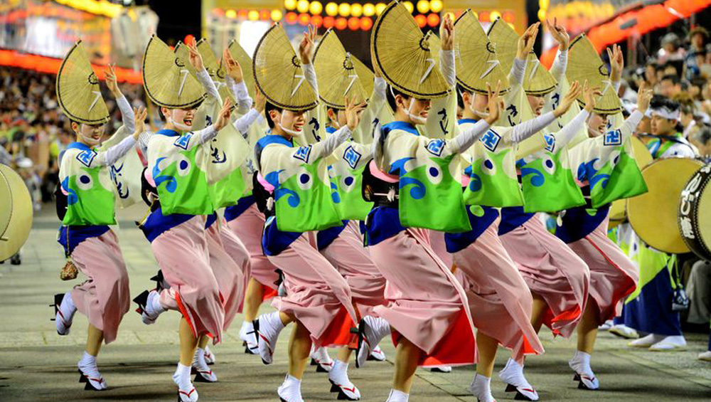
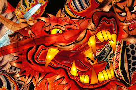
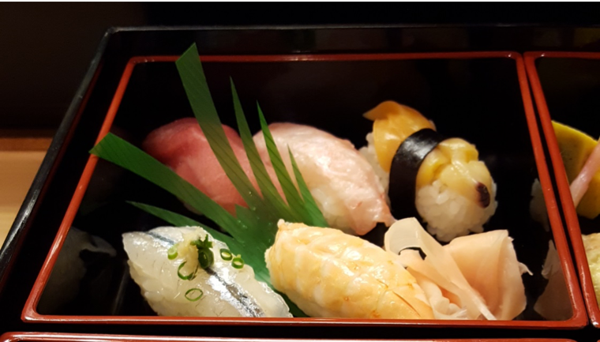
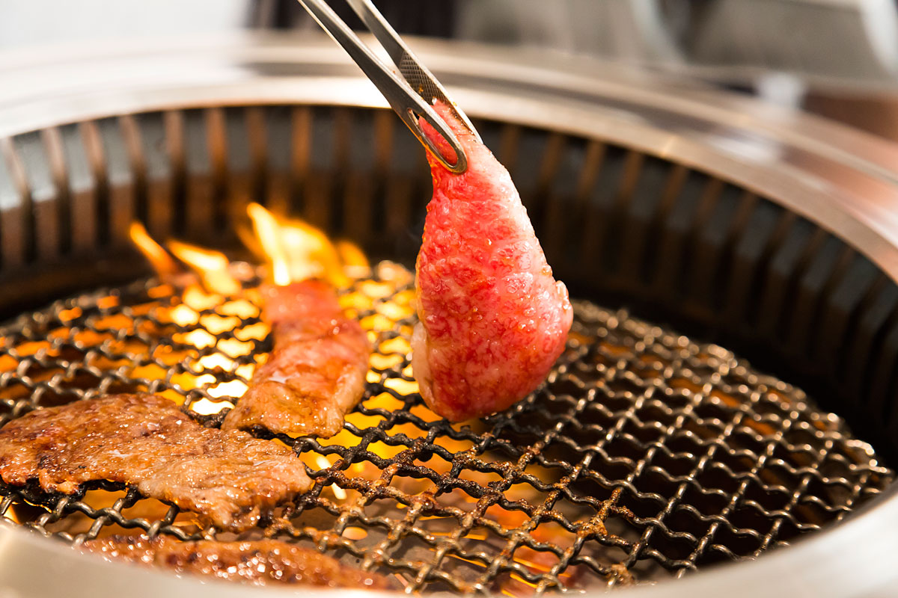
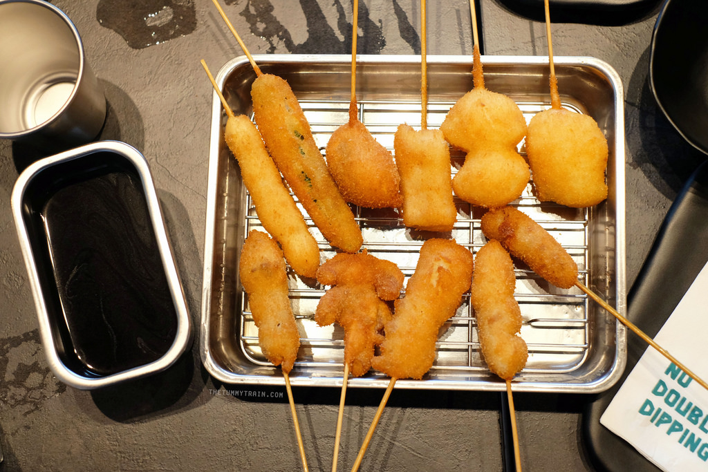

[ダウンロード/Download](assets/travel_japan.pdf)

  

日本は素晴らしい国です、でも、最初の日本旅行ですべてを見るのは無理です、あなたの旅行の時間は足りないんです、だからあなたの興味に応じて最高の場所を知ることはとても便利ですね。
日本の旅はすぐ始まります、<ruby>興味<rt>きょうみ</rt></ruby>があるものを<ruby>選<rt>えら</rt></ruby>んでください。

### [アニメと<ruby>漫画<rt>まんが</rt></ruby>](#アニメと漫画)

### [<ruby>温泉<rt>おんせん</rt></ruby>](#温泉)

### [ハイキング](#hiking)

### [<ruby>祭<rt>まつり</rt></ruby>](#祭)

### [<ruby>日本料理<rt>にほんりょうり</rt></ruby>](#日本料理)

## アニメと<ruby>漫画<rt>まんが</rt></ruby>

  

#### 1. <ruby>秋葉原<rt>あきはばら</rt></ruby>、東京

かつての<ruby>地方神社<rt>ちほうじんじゃ</rt></ruby>から秋葉と<ruby>呼<rt>よ</rt></ruby>ばれた秋葉原は、東京の中心にある多くのエレクトロニクスショップで有名な地区です。 近年、秋葉原は日本のオタク文化の中心地として<ruby>認知<rt>にんち</rt></ruby>され、アニメやマンガを<ruby>扱<rt>あつか</rt></ruby>う多くの<ruby>店舗<rt>てんぽ</rt></ruby>や<ruby>施設<rt>しせつ</rt></ruby>がこの地区の<ruby>電子店舗<rt>でんしてんぽ</rt></ruby>に<ruby>散在<rt>さんざい</rt></ruby>しています。<ruby>日曜日<rp>(</rp><rt>にちようび</rt><rp>)</rp></ruby>は13<ruby>時<rp>(</rp><rt>じ</rt><rp>)</rp></ruby>から18<ruby>時<rp>(</rp><rt>じ</rt><rp>)</rp></ruby>まで（10<ruby>月<rp>(</rp><rt>がつ</rt><rp>)</rp><ruby>から3<ruby>月<rp>(</rp><rt>がつ</rt><rp>)</rp><ruby>は17時まで地区の<ruby>大通<rp>(</rp><rt>おおどお</rt><rp>)</rp></ruby>りは<ruby>自動車交通<rp>(</rp><rt>じどうしゃこうつう</rt><rp>)</rp></ruby>が<ruby>閉鎖<rp>(</rp><rt>へいさ</rt><rp>)</rp>されます。

Akihabara also called Akiba after a former local shrine, is a district in central Tokyo that is famous for its many electronics shops. In more recent years, Akihabara has gained recognition as the center of Japan's otaku (diehard fan) culture, and many shops and establishments devoted to anime and manga are now dispersed among the electronic stores in the district. On Sundays, Chuo Dori, the main street through the district, is closed to car traffic from 13:00 to 18:00 (until 17:00 from October through March).

  

#### 2. <ruby>三鷹<rp>(</rp><rt>みたか</rt><rp>)</rp></ruby>の森ジブリ<ruby>美術館<rp>(</rp><rt>びじゅつかん</rt><rp>)</rp></ruby>

 ジブリ美術館は、<ruby>世界的<rp>(</rp><rt>せかいてき</rt><rp>)</rp></ruby>に<ruby>有名<rp>(</rp><rt>ゆうめい</rt><rp>)</rp></ruby>なスタジオジブリのアニメーションと美術館です。<ruby>宮崎駿<rp>(</rp><rt>みやざきはやお</rt><rp>)</rp></ruby>の手で<ruby>率<rp>(</rp><rt>ひき</rt><rp>)</rp></ruby>いられ 、となりのトトロ、もののけ姫、<ruby>千<rp>(</rp><rt>せん</rt><rp>)</rp></ruby>と<ruby>千尋<rp>(</rp><rt>ちひろ</rt><rp>)</rp></ruby>の<ruby>神隠<rp>(</rp><rt>かみかく</rt><rp>)</rp></ruby>し、<ruby>崖<rp>(</rp><rt>がけ</rt><rp>)</rp></ruby>の上のポニョなど世界的に<ruby>流通<rp>(</rp><rt>りゅうつう</rt><rp>)</rp></ruby>している<ruby>長編映画<rp>(</rp><rt>ちょうへんえいが</rt><rp>)</rp></ruby>を<ruby>多数制作<rp>(</rp><rt>たすうせいさく</rt><rp>)</rp>しています。

 <ruby>東京都心<rp>(</rp><rt>としん</rt><rp>)</rp></ruby>のすぐそばにある三鷹に<ruby>位置<rp>(</rp><rt>いち</rt><rp>)</rp></ruby>し、映画のファンには<ruby>必見<rp>(</rp><rt>ひっけん</rt><rp>)</rp></ruby>です。 美術館自体自体はスタジオの映画の<ruby>独特<rp>(</rp><rt>どくとく</rt><rp>)</rp></ruby>のスタイルでデザインされており、その上で、「天空の城ラピュタ」からの実物大のロボットを含む、映画の有名なキャラクタが見つけます。
 1階にはアニメーションの歴史と技術が展示されていて、スタジオジブリの美術館に限られている短い映画を展示する小さな劇場があります。 2階には特別な仮設展があります。 美術館にはカフェや子供の遊び場や屋上庭園やギフトショップもあります。

 The Ghibli Museum, is the animation and art museum of the worldwide acclaimed Studio Ghibli. Leaded by the hand of Hayao Miyazaki, they have produced many feature length films with worldwide distribution such as My Neighbor Totoro, Princess Mononoke, Spirited Away and Ponyo on the Cliff by the Sea.

 Located in Mitaka, just outside of central Tokyo, the museum is a must-see for fans of the films. The museum itself is designed in the distinct style of the studio's films, and many of their famous characters are there, including a life-sized robot from "Castle in the Sky" in the rooftop garden.

 The first floor of the museum exhibits the history and techniques of animation and has as a small theater which shows short movies by Studio Ghibli that are exclusive to the museum. The second floor houses special temporary exhibitions. The museum also has a cafe, children's play area, a rooftop garden and a gift shop.  
 [www.ghibli-museum.jp](www.ghibli-museum.jp)

 

   
 

#### 3. <ruby>富士<rp>(</rp><rt>ふじ</rt><rp>)</rp>急<rp>(</rp><rt>きゅう</rt><rp>)</rp></ruby>ハイランド、<ruby>進撃<rp>(</rp><rt>しんげき</rt><rp>)</rp></ruby>の<ruby>巨人<rp>(</rp><rt>きょじん</rt><rp>)</rp></ruby>THE RIDE とEVANGELION WORLD, <ruby>河口湖町<rp>(</rp><rt>かわぐちこまち</rt><rp>)</rp></ruby>

富士急ハイランドは日本で<ruby>最<rp>(</rp><rt>もっと</rt><rp>)</rp></ruby>も人気がある遊園地の一つで、富士山のふもとにある富士<ruby>五湖<rp>(</rp><rt>ごこ</rt><rp>)</rp>地域<rp>(</rp><rt>ちいき</rt><rp>)</rp></ruby>に<ruby>位置<rp>(</rp><rt>いち</rt><rp>)</rp></ruby>します。スリリング<ruby>記録破<rp>(</rp><rt>きろくやぶ</rt><rp>)</rp></ruby>りローラーコースターと<ruby>精巧<rp>(</rp><rt>せいこう</rt><rp>)</rp></ruby>なアニメテーマにした乗り物とアトラクションで最もよく知られています。 この遊園地は、テーマパークのエンターテイメントの<ruby>最前線<rp>(</rp><rt>さいぜんせん</rt><rp>)</rp></ruby>に<ruby>挑戦<rp>(</rp><rt>ちょうせん</rt><rp>)</rp></ruby>しており、ギネス世界記録を破るローラーコースターと新しいアトラクションを<ruby>常<rp>(</rp><rt>つね</rt><rp>)</rp></ruby>に建てています。

Fuji-Q Highland (富士急) is one of Japan's most popular amusement parks, located in the Fuji Five Lake region at the foot of Mount Fuji. It is best known for its thrilling, record-breaking roller coasters and elaborate, anime- themed rides and attractions like THE RIDE featuring attack on titan characters and EVANGELION WORLD. The park strives to be at the forefront of theme park entertainment, and has been constantly opening new rides and attractions, including Guinness World Record breaking roller coasters.  
[http://ｗww.fujiq.jp](http://ｗww.fujiq.jp)

他の<ruby>素晴<rp>(</rp><rt>すば</rt><rp>)</rp></ruby>らしい良い<ruby>経験<rp>(</rp><rt>けいけん</rt><rp>)</rp></ruby>

* 君の名は映画の本当の場所への<ruby>巡礼<rp>(</rp><rt>じゅんれい</rt><rp>)</rp></ruby>、東京、<ruby>飛騨<rp>(</rp><rt>ひだ</rt><rp>)</rp></ruby> <ruby>岐阜県<rp>(</rp><rt>ぎふけん</rt><rp>)</rp></ruby>  
[http://www.tofugu.com/japan/your-name-locations](http://www.tofugu.com/japan/your-name-locations)

* <ruby>京都国際<rp>(</rp><rt>きょうとこくさい</rt><rp>)</rp></ruby>マンガミュージアム  
[http://www.kyotomm.jp](http://www.kyotomm.jp)

* Anime Japan 毎年3月、東京  
[http://www.anime-japan.jp](http://www.anime-japan.jp)

* J-World、東京  
[http://bandainamco-am.co.jp/tp/j-world](http://bandainamco-am.co.jp/tp/j-world)

## <ruby>温泉<rt>おんせん</rt></ruby>

  

#### 1. <ruby>草津<rt>くさつ</rt></ruby>温泉、<ruby>群馬県<rt>ぐんまけん</rt></ruby>

草津温泉は、日本で<ruby>最<rt>もっと</rt></ruby>も<ruby>有名<rt>ゆうめい</rt></ruby>な温泉<ruby>地帯<rt>ちたい</rt></ruby>のひとつであり、<ruby>恋煩<rt>こいわずら</rt></ruby>い<ruby>以外<rt>いがい</rt></ruby>あらゆる<ruby>病気<rt>びょうき</rt></ruby>を<ruby>治療<rt>ちりょう</rt></ruby>するといわれる<ruby>高品質<rt>こうひんしつ</rt></ruby>の温泉<ruby>水<rt>みず</rt></ruby>が<ruby>大量<rt>たいりょう</rt></ruby>に<ruby>恵<rt>めぐ</rt></ruby>まれています。
<ruby>何<rt>なん</rt>世紀<rt>せいき</rt></ruby>にもわたって温泉地として知られていた草津の<ruby>名声<rt>めいせい</rt></ruby>は、1800<ruby>年代<rt>ねんだい</rt></ruby><ruby>後期<rt>こうき</rt></ruby>に<ruby>皇室<rt>こうしつ</rt></ruby>に<ruby>勤<rt>つと</rt></ruby>めたドイツの<ruby>医師<rt>いし</rt></ruby>によってさらに<ruby>拡大<rt>かくだい</rt></ruby>されました。彼は水の<ruby>健康上<rt>けんこうじょう</rt></ruby>の<ruby>利益<rt>りえき</rt></ruby>のために草津を<ruby>勧<rt>すす</rt></ruby>めました。群馬県の<ruby>山々<rt>やまやま</rt></ruby>の<ruby>標高<rt>ひょうこう</rt></ruby>1200mの草津に<ruby>位置<rt>いち</rt></ruby>し、冬にスキーがあり、<ruby>一年中<rt>いちねんじゅう</rt></ruby>ハイキングも温泉<ruby>浴<rt>よく</rt></ruby>と<ruby>組<rt>く</rt></ruby>み<ruby>合<rt>あ</rt></ruby>わせて<ruby>楽<rt>たの</rt></ruby>しむことができます。

Kusatsu Onsen is one of Japan's most famous hot spring resorts and is blessed with large volumes of high quality hot spring water said to cure every illness but lovesickness.

Well known as a hot spring resort for many centuries, Kusatsu's fame was further extended by German doctor Erwin von Baelz, who served at the imperial court in the late 1800s and recommended Kusatsu for its water's health benefits.

Kusatsu is situated at an altitude of 1200 meters above sea level in the mountains of Gunma Prefecture, and offers skiing in winter and hiking during the rest of the year to be enjoyed in combination with hot spring bathing.

[http://www.kusatsu-onsen.ne.jp/](http://www.kusatsu-onsen.ne.jp/)

  

#### 2. <ruby>黒川<rt>くろかわ</rt></ruby>温泉、<ruby>熊本県<rt>くまもとけん</rt></ruby>

黒川温泉は、<ruby>阿蘇山<rt>あそさん</rt></ruby>から<ruby>北約<rt>きたやく</rt></ruby>20km 、<ruby>九州<rt>きゅうしゅう</rt></ruby>の<ruby>真<rt>ま</rt></ruby>ん<ruby>中<rt>なか</rt></ruby>に<ruby>位置<rt>いち</rt></ruby>する日本<ruby>最高<rt>さいこう</rt></ruby>の<ruby>魅力的<rt>みりょくてき</rt></ruby>な温泉<ruby>街<rt>がい</rt></ruby>の一つです。黒川<ruby>町<rt>まち</rt></ruby>は<ruby>快適<rt>かいてき</rt></ruby>さと<ruby>伝統的<rt>でんとうてき</rt></ruby>な<ruby>雰囲気<rt>ふんいき</rt></ruby>を<ruby>維持<rt>いじ</rt></ruby>するため<ruby>努力<rt>どりょく</rt></ruby>をしています。黒川には<ruby>巨大<rt>きょだい</rt></ruby>なコンクリートホテルやネオン<ruby>広告<rt>こうこく</rt></ruby>や<ruby>騒々<rt>そうぞう</rt></ruby>しい<ruby>色<rt>いろ</rt></ruby>がないので、<ruby>他<rt>ほか</rt></ruby>のリゾートタウン町と<ruby>似<rt>に</rt></ruby>ていません。  

その<ruby>代<rt>か</rt></ruby>わりに、黒川の<ruby>街並<rt>まちな</rt></ruby>みは<ruby>自然<rt>しぜん</rt></ruby>の色や<ruby>材質<rt>ざいしつ</rt></ruby>、<ruby>木造建築物<rt>もくぞうけんちくぶつ</rt></ruby>、<ruby>土壁<rt>どへき</rt></ruby>、<ruby>石<rt>いし</rt></ruby>の<ruby>階段<rt>かいだん</rt></ruby>、川が<ruby>流<rt>なが</rt></ruby>れているおきます。<ruby>森林地帯<rt>しんりんちたい</rt></ruby>の<ruby>谷<rt>たに</rt></ruby>に位置する町の<ruby>中心部<rt>ちゅうしんぶ</rt></ruby>は<ruby>徒歩<rt>とほ</rt></ruby>で<ruby>探索<rt>たんさく</rt></ruby>しやすいですが、<ruby>中央<rt>ちゅうおう</rt></ruby>に位置しない<ruby>少数<rt>しょうすう</rt></ruby>の<ruby>旅館<rt>りょかん</rt></ruby>は<ruby>例外<rt>れいがい</rt></ruby>です。

Kurokawa Onsen is one of Japan's most attractive hot springtowns, located in the middle of Kyushu about 20 kilometers north of Mount Aso. Well coordinated efforts by the town to maintain a pleasant, traditional atmosphere have kept Kurokawa free of the massive concrete hotels, neon advertisements and loud colors that are encountered in many of Japan's other resort towns.

Instead, Kurokawa's townscape is dominated by natural colors and materials, wooden buildings, earthen walls, stone stairs and a river flowing through. The town center, located in a forested valley, is easily explored on foot, except for a few ryokan which are located less centrally.

[www.yamamizuki.com](www.yamamizuki.com)

  

#### 3.	<ruby>城崎<rt>きのさき</rt></ruby>温泉、<ruby>兵庫<rt>ひょうご</rt>県

<ruby>伝説<rt>でんせつ</rt></ruby>によると、城崎の<ruby>沼地<rt>ぬまち</rt></ruby>でコウノトリは<ruby>傷<rt>きず</rt></ruby>を<ruby>治癒<rt>ちゆ</rt></ruby>するために<ruby>浴<rt>あ</rt></ruby>びたということです。 その<ruby>後<rt>あと</rt></ruby>、この<ruby>場所<rt>ばしょ</rt></ruby>に<ruby>癒<rt>いや</rt></ruby>しの水を<ruby>利用<rt>りよう</rt></ruby>するために<ruby>色々<rt>いろいろ</rt></ruby>な<ruby>浴場<rt>よくじょう</rt></ruby>が<ruby>建<rt>た</rt></ruby>てられました。 それ<ruby>以来<rt>いらい</rt></ruby>、<ruby>関西<rt>かんさい</rt></ruby>で城崎がトップの温泉地になっています。
<ruby>現在<rt>げんざい</rt></ruby>、このエリアに<ruby>数多<rt>かずおお</rt></ruby>く温泉<ruby>旅館<rt>りょかん</rt></ruby>があります、しかし、<ruby>本当<rt>ほんとう</rt></ruby>の<ruby>観光<rt>かんこう</rt></ruby>スポットは7つの<ruby>大浴場<rt>だいよくじょう</rt></ruby>です。 <ruby>街中<rt>まちなか</rt></ruby>には、<ruby>美<rt>うつく</rt></ruby>しい<ruby>足湯<rt>あしゆ</rt></ruby>と<ruby>噴水<rt>ふんすい</rt></ruby>も<ruby>散在<rt>さんざい</rt></ruby>しています。

Legend has it that storks would bathe in the marshes of Kinosaki to heal their wounds. Later, bath houses were built over these very sites to take advantage of the healing waters. Since then Kinosaki has become a top onsen destination in the Kansai region.
Nowadays there are numerous ryokan in the area, all with their own baths, but the real draw to Kinosaki are its seven public bath houses (sotoyu). Also scattered throughout town are some beautiful foot baths (ashiyu) and fountains.

他の素晴らしい<ruby>経験<rt>けいけん</rt></ruby>

* 箱根温泉、神奈川県  
  [http://www.hakone.or.jp/en/](http://www.hakone.or.jp/en/)

* 由布院温泉、大分県  
  [yufuin-ublhotel.jp/en/](yufuin-ublhotel.jp/en/)

* 別府温泉  
  [http://www.gokuraku-jigoku-beppu.com](http://www.gokuraku-jigoku-beppu.com)

* 登別温泉、北海道  
  [http://www.takimotokan.co.jp/english/](http://www.takimotokan.co.jp/english/)

* 道後温泉、松山市、愛媛県  
  [dogo.jp](dogo.jp)

## ハイキング

  

#### 1. <ruby>富士山<rt>ふじさん</rt></ruby>、<ruby>山梨県<rt>やまなしけん</rt></ruby>と<ruby>静岡県<rt>しずおかけん</rt></ruby>、7月から9月10日まで

日本で<ruby>最<rt>もっと</rt></ruby>も<ruby>高<rt>たか</rt></ruby>く、最も<ruby>有名<rt>ゆうめい</rt></ruby>な山、富士山を<ruby>登<rt>のぼ</rt></ruby>るのは<ruby>一生<rt>いっしょう</rt></ruby>の<ruby>思<rt>おも</rt></ruby>い<ruby>出<rt>で</rt></ruby>になるでしょう。 山は<ruby>遠<rt>とお</rt></ruby>くから<ruby>魅力的<rt>みりょくてき</rt></ruby>に<ruby>見<rt>み</rt></ruby>えるかもしれませんが、<ruby>晴<rt>は</rt></ruby>れた日の<ruby>景色<rt>けしき</rt></ruby>と、<ruby>世界中<rt>せかいじゅう</rt></ruby>の<ruby>何百<rt>なにひゃく</rt></ruby><ruby>登山者<rt>とざんしゃ</rt></ruby>の<ruby>早朝<rt>そうちょう</rt></ruby>の<ruby>登山<rt>とざん</rt></ruby>の<ruby>経験<rt>けいけん</rt></ruby>は<ruby>非常<rt>ひじょう</rt></ruby>に<ruby>有益<rt>ゆうえき</rt></ruby>です

Climbing Mount Fuji (3776 meters), Japan's highest and most prominent mountain, can make for lifelong memories. The mountain may look more attractive from afar but the views on clear days and the experience of climbing through the early morning hours among hundreds of hikers from across the world are very rewarding.

  

#### 2. <ruby>大雪山<rt>だいせつざん</rt></ruby>、<ruby>北海道<rt>ほっかいどう</rt></ruby>、7月から9月10日

大雪山は北海道<ruby>最大<rt>さいだい</rt></ruby>の<ruby>国立<rt>こくりつ</rt></ruby><ruby>公園<rt>こうえん</rt></ruby>です。 日本の<ruby>小規模<rt>しょうきぼ</rt></ruby>な<ruby>都道府県<rt>とどうふけん</rt></ruby>よりも<ruby>大<rt>おお</rt></ruby>きい、<ruby>事実上手<rt>じじつじょうて</rt></ruby>つかずの<ruby>荒野<rt>こうや</rt></ruby>の<ruby>山間部<rt>さんかんぶ</rt></ruby>を<ruby>保<rt>たも</rt></ruby>っています。 ハイカーや<ruby>野外愛好家<rt>やがいあいこうか</rt></ruby>や<ruby>鹿<rt>しか</rt></ruby>のための<ruby>楽園<rt>らくえん</rt></ruby>であり、毎年、<ruby>秋<rt>あき</rt></ruby>の<ruby>紅葉<rt>こうよう</rt></ruby>や<ruby>雪<rt>ゆき</rt></ruby>を<ruby>見<rt>み</rt></ruby>るのも日本で<ruby>初<rt>はじ</rt></ruby>めてみられます。

Daisetsuzan is Hokkaido's largest national park. It preserves a mountainous area of virtually unspoiled wilderness, which is larger than some of Japan's smaller prefectures. It is a paradise for hikers, outdoor lovers and deers, it is also the first place in Japan to see fall colors and snow each autumn.

  

#### 3. <ruby>上高地<rt>かみこうち</rt></ruby>、<ruby>長野県<rt>ながのけん</rt></ruby>、<ruby>春<rt>はる</rt></ruby>、<ruby>夏<rt>なつ</rt></ruby>、<ruby>秋<rt>あき</rt></ruby>

上高地は長野県北アルプスの<ruby>人気<rt>にんき</rt></ruby>リゾートで、日本で<ruby>最<rt>もっと</rt></ruby>も<ruby>雄大<rt>ゆうだい</rt></ruby>な山の<ruby>景色<rt>けしき</rt></ruby>を<ruby>提供<rt>ていきょう</rt></ruby>しています。 4<ruby>月中<rt>がつちゅう</rt></ruby><ruby>旬<rt>しゅん</rt></ruby>〜11月15日まで<ruby>営業<rt>えいぎょう</rt></ruby>しており、<ruby>冬期<rt>とうき</rt></ruby>は<ruby>休業<rt>きゅうぎょう</rt></ruby>となります。

Kamikochi is a popular resort in the Northern Japan Alps of Nagano Prefecture, offering some of Japan's most spectacular mountain scenery. It is open from mid/late April until November 15 and shuts down during winter.

## <ruby>祭<rt>まつり</rt></ruby>

  

#### 1. <ruby>祇園祭<rt>ぎおん</rt></ruby>、<ruby>京都<rt>きょうと</rt></ruby>

<ruby>日本<rt>にほん</rt></ruby><ruby>三大<rt>さんだい</rt></ruby>祭のひとつに<ruby>挙<rt>あ</rt></ruby>げられる<ruby>京都市東山区<rt>ひがしやまく</rt></ruby>にある<ruby>八坂<rt>やさか</rt></ruby><ruby>神社<rt>じんじゃ</rt></ruby>の<ruby>祭礼<rt>さいれい</rt></ruby>。<ruby>7月<rt>がつ</rt></ruby>を<ruby>迎<rt>むか</rt></ruby>えると、京都の町は一年で<ruby>最<rt>もっと</rt></ruby>も<ruby>華<rt>はな</rt></ruby>やぐ。9<ruby>世紀<rt>せいき</rt></ruby>より<ruby>続<rt>つづ</rt></ruby>く1100<ruby>年<rt>ねん</rt></ruby><ruby>以上<rt>いじょう</rt></ruby>の<ruby>歴史<rt>れきし</rt></ruby>、1ヶ月に<ruby>渡<rt>わた</rt></ruby>る<ruby>祭事<rt>さいじ</rt></ruby>の<ruby>豪華<rt>ごうか</rt></ruby>さや<ruby>壮大<rt>そうだい</rt></ruby>さは、<ruby>世界<rt>かい</rt></ruby>でも<ruby>有数<rt>ゆうすう</rt></ruby>であり<ruby>国内外<rt>こくないがい</rt></ruby>より<ruby>毎年<rt>まいとし</rt></ruby><ruby>数十<rt>すうじゅう</rt></ruby><ruby>万人<rt>まんにん</rt></ruby>の<ruby>観光客<rt>かんこうきゃく</rt></ruby>を<ruby>集<rt>あつ</rt></ruby>める。
この祭りのハイライトは、「<ruby>山鉾<rt>やまほこ</rt></ruby><ruby>巡行<rt>じゅんこう</rt></ruby>」。2014年より<ruby>約半世紀<rt>やくはんせいき</rt></ruby>ぶりに<ruby>本来<rt>ほんらい</rt></ruby>の<ruby>姿<rt>すがた</rt></ruby>に<ruby>戻<rt>もど</rt></ruby>り、「<ruby>前祭<rt>さきまつり</rt></ruby>（7月17日）」と「<ruby>後祭<rt>あとまつり</rt></ruby>（24日）」の二度に<ruby>分<rt>わ</rt></ruby>かれて<ruby>合計<rt>ごうけい</rt></ruby>33<ruby>基<rt>き</rt></ruby>の山鉾が<ruby>京都<rt>きょうと</rt></ruby>の町を巡行する。
山鉾と<ruby>呼<rt>よ</rt></ruby>ばれる<ruby>山車<rt>だし</rt></ruby>は、<ruby>最大<rt>さいだい</rt></ruby>12トンにも<ruby>達<rt>たっ</rt></ruby>し、お<ruby>囃子<rt>はやし</rt></ruby>が<ruby>乗<rt>の</rt></ruby>る<ruby>屋台<rt>やたい</rt></ruby>に<ruby>木製<rt>もくせい</rt></ruby>の<ruby>車輪<rt>しゃりん</rt></ruby>を<ruby>備<rt>そな</rt></ruby>えて<ruby>移動<rt>いどう</rt></ruby>する。<ruby>数百年前<rt>すうひゃくねんまえ</rt></ruby>に<ruby>世界中<rt>せかいじゅう</rt></ruby>より<ruby>集<rt>あつ</rt></ruby>められた<ruby>至宝<rt>しほう</rt></ruby>をまとうその<ruby>姿<rt>すがた</rt></ruby>は、まさに「<ruby>動<rt>うご</rt></ruby>く<ruby>美術館<rt>びじゅつかん</rt></ruby>」。<ruby>現存<rt>げんそん</rt></ruby>する山鉾の33基のうち29基は<ruby>国<rt>くに</rt></ruby>の<ruby>重要<rt>じゅうよう</rt></ruby><ruby>有形<rt>ゆうけい</rt></ruby><ruby>民俗<rt>みんぞく</rt></ruby><ruby>文化財<rt>ぶんかざい</rt></ruby>に<ruby>指定<rt>してい</rt></ruby>され、「京都<ruby>祇園<rt>ぎおん</rt></ruby>祭の山鉾<ruby>行事<rt>ぎょうじ</rt></ruby>」はユネスコ<ruby>文化<rt>ぶんか</rt></ruby><ruby>遺産<rt>いさん</rt></ruby>にされている。

Gion Matsuri is an annual festival of the Yasaka Shrine located in Higashiyama of Kyoto, and is one of the three biggest festivals of Japan. When July comes, it is the most vibrant and festive month for Kyoto. The month-long celebrations with its over 1,100 year-long history makes the festival a rare occurrence even for world standards, attracting hundreds of thousands of visitors from all across the country and abroad. The highlight of the festival is the "_Yamahoko Junko_". From 2014, the festival format has returned to its original form for the first time in half a century, with the total of 33 _Yamahoko_ floats separated into parading during _Sakimatsuri_ (July 17th) and _Atomatsuri_ (July 24th). The floats known as _Yamaboko_ reach up to 12 tons in weight, and are pulled on wooden wheels with the chanting musicians aboard. The sight of them covered with few-hundred year-old treasures gathered from all over the world, is no short from a moving museum. 29 out of the 33 remaining floats are designated as the nation's Important Tangible Folk Cultural Property, and the _Yamaboko_ events of Gion Festival are recognized as a UNESCO cultural heritage.

  

#### 2. <ruby>阿波<rt>あわ</rt></ruby><ruby>踊<rt>おど</rt></ruby>り祭<ruby>徳島市<rt>とくしまし</rt></ruby>８月12日から8月15日まで

「踊るあほに<ruby>見<rt>み</rt></ruby>るあほ、<ruby>同<rt>おな</rt></ruby>じあほなら踊らにゃ」、これは日本で<ruby>唱<rt>とな</rt></ruby>えられた<ruby>伝統的<rt>でんとうてき</rt></ruby>なフレーズで、 阿波踊りはすべてについてです：見ることよりも<ruby>参加<rt>さんか</rt></ruby>して踊る<ruby>方<rt>ほう</rt></ruby>が<ruby>楽<rt>たの</rt></ruby>しいです！
<ruby>参加者<rt>さんかしゃ</rt></ruby>は、<ruby>最高<rt>さいこう</rt></ruby>のダンスを<ruby>競<rt>きそ</rt></ruby>うチームを<ruby>形成<rt>けいせい</rt></ruby>します。 <ruby>誰<rt>だれ</rt></ruby>でも<ruby>太鼓<rt>たいこ</rt></ruby>と<ruby>笛<rt>ふえ</rt></ruby>のリズムに<ruby>夢中<rt>むちゅう</rt></ruby>になることができます。 ２<ruby>種類<rt>しゅるい</rt></ruby>のダンススタイルがあります、<ruby>男<rt>おとこ</rt></ruby>踊りはダイナミックで<ruby>面白<rt>おもしろ</rt></ruby>い踊りですが、<ruby>女<rt>おんな</rt></ruby>踊りは<ruby>華<rt>はな</rt></ruby>やかでエレガントな踊りです。徳島<ruby>市<rt>し</rt></ruby>は祭りの<ruby>間<rt>あいだ</rt></ruby>にとても<ruby>活気<rt>かっき</rt></ruby>が<ruby>溢<rt>あふ</rt></ruby>れていて、<ruby>確<rt>たし</rt></ruby>かに踊ることを<ruby>喜<rt>よろこ</rt></ruby>ぶでしょう。

Odoru aho ni miru aho. Onaji aho nara odoranya！Dancing fools and watching fools. Both are the same fools, so why not dance?!) This is a traditional phrase chanted in Japan and it is what Awa Odori is all about: it is more fun to join and dance than to watch. The dancers form teams to compete for the best dance. Anyone can go crazy dancing to the rhythm of drums, bells and flutes. There are two dancing styles: Otoko-odori (male dancing) which is dynamic and funny and Onna-odori (female dancing) which is sultry and elegant. You will surely be delighted dancing in the city of tokushima which gets very lively during the festival.

  

#### 3. ねぶた祭、<ruby>青森<rt>あおもり</rt></ruby>市8月2日から８月7日まで

ねぶた祭りは日本の中でも、トップクラスの大きな祭りだ。「ねぶた」といわれる<ruby>巨大<rt>きょだい</rt></ruby>な<ruby>人形<rt>にんぎょう</rt></ruby><ruby>灯籠<rt>とうろう</rt></ruby>が<ruby>街<rt>まち</rt></ruby>を<ruby>練<rt>ね</rt></ruby>り<ruby>歩<rt>ある</rt></ruby>く祭りで、<ruby>歌舞伎<rt>かぶき</rt></ruby>の<ruby>名場面<rt>めいばめん</rt></ruby>や<ruby>歴史物語<rt>れきしものがたり</rt></ruby>、<ruby>神話<rt>しんわ</rt></ruby>などを<ruby>題材<rt>だいざい</rt></ruby>に<ruby>毎年<rt>まいとし</rt></ruby><ruby>新<rt>あら</rt></ruby>たに<ruby>制作<rt>せいさく</rt></ruby>され、その<ruby>大<rt>おお</rt></ruby>きさは<ruby>幅<rt>はば</rt></ruby>9ｍ、<ruby>奥行<rt>おくゆ</rt></ruby>き7ｍ、<ruby>高<rt>たか</rt></ruby>さ5ｍにもおよぶ。その<ruby>幽玄<rt>ゆうげん</rt></ruby>な<ruby>姿<rt>すがた</rt></ruby>は<ruby>光<rt>ひかり</rt></ruby>のアート<ruby>作品<rt>さくひん</rt></ruby>とも<ruby>言<rt>い</rt></ruby>えるだろう。<ruby>運行<rt>うんこう</rt></ruby>には<ruby>扇子持<rt>せんすもち</rt></ruby>といわれる<ruby>笛<rt>ふえ</rt></ruby>と<ruby>扇子<rt>せんす</rt></ruby>で<ruby>曳<rt>ひ</rt></ruby>き<ruby>手<rt>て</rt></ruby>に<ruby>合図<rt>あいず</rt></ruby>を<ruby>送<rt>おく</rt></ruby>りねぶたをイキイキと<ruby>躍動的<rt>やくどうてき</rt></ruby>に<ruby>魅<rt>み</rt></ruby>せる<ruby>人<rt>ひと</rt></ruby>や、4t<ruby>近<rt>ちか</rt></ruby>いねぶたを扇子持の合図で<ruby>動<rt>うご</rt></ruby>かす曳き手のほか、<ruby>太鼓<rt>たいこ</rt></ruby>・笛・<ruby>手振<rt>てぶ</rt></ruby>り<ruby>鉦<rt>かね</rt></ruby>からなる<ruby>囃子方<rt>はやしかた</rt></ruby>、お囃子に<ruby>合<rt>あ</rt></ruby>わせて「ラッセ、ラッセ」の<ruby>掛<rt>か</rt></ruby>け<ruby>声<rt>こえ</rt></ruby>で<ruby>跳<rt>は</rt></ruby>ね踊る跳人<rt>はねと</rt></ruby>が参加する。美しい「ねぶた」と人々が<ruby>一体<rt>いったい</rt></ruby>となって<ruby>盛<rt>さか</rt></ruby>り<ruby>上<rt>あ</rt></ruby>がる、<ruby>青森<rt>あおもり</rt></ruby>の<ruby>夏<rt>なつ</rt></ruby>の<ruby>夜<rt>よる</rt></ruby>の<ruby>風物詩<rt>ふうぶつし</rt></ruby>だ。

## <ruby>日本料理<rt>にほんりょうり</rt></ruby>

日本ではおいしいものがたくさんあります。 <ruby>寿司<rt>すし</rt></ruby>が一番<ruby>人気<rt>にんき</rt></ruby>があるかもしれませんが、日本<ruby>食<rt>しょく</rt></ruby>ははるかに<ruby>多様<rt>たよう</rt></ruby>です。日本にいる<ruby>間<rt>あいだ</rt></ruby>に<ruby>試<rt>ため</rt></ruby>してみなければならないトップ4の<ruby>食品<rt>しょくひん</rt></ruby>の<ruby>味<rt>あじ</rt></ruby>をお<ruby>届<rt>とど</rt></ruby>けします。

There's so many delicious things to eat in Japan. Sushi might be the most popular, but Japanese food has so much more variety、we'll give you taste of the top ４ foods that you should try while you're in Japan.

  

#### 1. <ruby>寿司<rt>すし</rt></ruby>

どこに<ruby>行<rt>い</rt></ruby>くかは<ruby>関係<rt>かんけい</rt></ruby>ありませんが、日本では寿司はずっと<ruby>新鮮<rt>しんせん</rt></ruby>で、どこよりも多様です。 <ruby>季節<rt>きせつ</rt></ruby>の<ruby>美味<rt>おい</rt></ruby>しい<ruby>魚<rt>さかな</rt></ruby>の<ruby>多<rt>おお</rt></ruby>くは、<ruby>日本国外<rt>こくがい</rt></ruby>では<ruby>入手<rt>にゅうしゅ</rt></ruby>できません。 <ruby>例<rt>たと</rt></ruby>えば、たい、あじ、かんぱちは、あなたが食べることができる<ruby>最高<rt>さいこう</rt></ruby>の<ruby>白身魚<rt>しろみざかな</rt></ruby>ですが、<ruby>日本国外<rt>にっぽんこくがい</rt></ruby>ではほとんど<ruby>見<rt>み</rt></ruby>られません。 そして、寿司は、日本では<ruby>一般的<rt>いっぱんてき</rt></ruby>にはるかに安いです（日本の寿司20ドル<ruby>相当<rt>そうとう</rt></ruby>は<ruby>米国<rt>べいこく</rt></ruby>で40ドルを<ruby>超<rt>こ</rt></ruby>えることになります）。
<ruby>最高<rt>さいこう</rt></ruby>の寿司を<ruby>入手<rt>にゅうしゅ</rt></ruby>する<ruby>場所<rt>ばしょ</rt></ruby>：
東京にいるなら（<ruby>早起<rt>はやお</rt></ruby>きで<ruby>朝食<rt>ちょうしょく</rt></ruby>に寿司を<ruby>気<rt>き</rt></ruby>にしないでください）、新鮮な寿司を食べるのに<ruby>最適<rt>さいてき</rt></ruby>な場所は、おそらく<ruby>築地<rt>つきじ</rt></ruby>の<ruby>魚市場<rt>うおいちば</rt></ruby>の<ruby>小<rt>ちい</rt></ruby>さなレストランの一つです。 ランチに最高のお寿司を食べたいと<ruby>思<rt>おも</rt></ruby>ったら、<ruby>渋谷<rt>しぶや</rt></ruby>で<ruby>梅丘<rt>うめがおか</rt></ruby>寿司の<ruby>美登利総本店<rt>みどりそうほんてん</rt></ruby>をチェックしてください。<ruby>高級<rt>こうきゅう</rt></ruby>寿司を20ドル<ruby>以下<rt>いか</rt></ruby>で<ruby>買<rt>か</rt></ruby>うことができます。

It doesn’t matter where you go, sushi is much fresher and has way more variety in Japan than anywhere else. A lot of the seasonal and most delicious fish just aren’t available outside of Japan. For example the Sea Bream (たい), Saurel (あじ), and Amberjack (かんぱち) are some of the tastiest whitefish you can eat, but are rarely found outside of Japan. And sushi is typically much cheaper in Japan too ($20 equivalent of sushi in Japan will cost you over $40 in the US).
Where to get the best sushi:
If you are in Tokyo (and can get up early and don’t mind sushi for breakfast), the best place to get the freshest sushi is probably at one of the many small restaurants in the Tsukiji fish market. If you feel like getting the best bang-for-the-buck sushi for lunch, check out Umegaoka Sushi (梅丘寿司の美登利総本店) in Shibuya where you can a ton of high-quality sushi for less than $20

  

#### 2. <ruby>焼肉<rt>やきにく</rt></ruby>

<ruby>焼肉<rt>やきにく</rt></ruby>は、日本で最も<ruby>人気<rt>にんき</rt></ruby>のある（そして<ruby>楽<rt>たの</rt></ruby>しい）<ruby>食事<rt>しょくじ</rt></ruby>のひとつです。 日本<ruby>全国<rt>ぜんこく</rt></ruby>にはたくさんの焼肉<ruby>屋<rt>や</rt></ruby>があり、食べ<ruby>放題<rt>ほうだい</rt></ruby>のビュッフェがあります。 しかし、もしあなたが<ruby>本当<rt>ほんとう</rt></ruby>のことを<ruby>望<rt>のぞ</rt></ruby>むならば、日本<ruby>全土<rt>ぜんど</rt></ruby>で<ruby>最高<rt>さいこう</rt></ruby>の<ruby>食<rt>しょく</rt></ruby>を見つけることができるなら、<ruby>飛騨<rt>ひだ</rt></ruby>の高山町に<ruby>向<rt>む</rt></ruby>かう<ruby>必要<rt>ひつよう</rt></ruby>があります。 東京の北にある<ruby>農村部<rt>のうそんぶ</rt></ruby>は、<ruby>伝統的<rt>でんとうてき</rt></ruby>な日本と<ruby>素晴<rt>すば</rt></ruby>らしい温泉を<ruby>体験<rt>たいけん</rt></ruby>するのに<ruby>最適<rt>さいてき</rt></ruby>な<ruby>場所<rt>ばしょ</rt></ruby>だけではなく、<ruby>有名<rt>ゆうめい</rt></ruby>な<ruby>飛騨牛<rt>ひだぎゅう</rt></ruby>の<ruby>本場<rt>ほんば</rt></ruby>です。 <ruby>神戸牛<rt>こうべぎゅう</rt></ruby>のようによく<ruby>知<rt>し</rt></ruby>られているわけではありませんが、よだれが出るほど美味しいです。

Japanese BBQ is one of Japan’s most popular (and fun) meals you can have. There are a ton of great Yakiniku restaurants and all-you-can-eat buffets all over Japan. But if you want the real deal, and some of the best meat you can find in all of Japan, you’ve got to head to Hida-Takayama. This sleepy rural area north of Tokyo is not only a great place to experience traditional Japan and amazing hot springs, but is home to the renowned Hida-beef. It’s not as well-known (or pricey) as the Kobe-beef, but it’s still just as much saliva-inducing.

  

#### 3. <ruby>串<rt>くし</rt></ruby>カツ

フライドフードに<ruby>誰<rt>だれ</rt></ruby>も‘「いいえ」とは<ruby>言<rt>い</rt></ruby>わない！ <ruby>天<rt>てん</rt></ruby>ぷらは、<ruby>最<rt>もっと</rt></ruby>もよく<ruby>知<rt>し</rt></ruby>られたタイプの日本のフライドフードです。 <ruby>私<rt>わたし</rt></ruby>の<ruby>個人的<rt>こじんてき</rt></ruby>な<ruby>好<rt>この</rt></ruby>みは串カツです。<ruby>串焼<rt>くしや</rt></ruby>きは、<ruby>大阪<rt>おおさか</rt></ruby>を<ruby>拠点<rt>きょてん</rt></ruby>にしていますが、日本<ruby>全土<rt>ぜんど</rt></ruby>に<ruby>広<rt>ひろ</rt></ruby>がっています。 たくさんの<ruby>種類<rt>しゅるい</rt></ruby>の串カツがあるので、食べるのは<ruby>本当<rt>ほんとう</rt></ruby>に<ruby>面白<rt>おもしろ</rt></ruby>いです。 それは<ruby>典型的<rt>てんていてき</rt></ruby>な<ruby>居酒屋<rt>いざかや</rt></ruby>タイプのバーフードとして<ruby>提供<rt>ていきょう</rt></ruby>されていますが、<ruby>最高<rt>さいこう</rt></ruby>の串カツレストランの中には、シェフがプレミアムミートと<ruby>季節<rt>きせつ</rt></ruby>の<ruby>野菜<rt>やさい</rt></ruby>のマルチコースを<ruby>提供<rt>ていきょう</rt></ruby>する<ruby>場所<rt>ばしょ</rt></ruby>があります。
最高の串カツを<ruby>取得<rt>しゅとく</rt></ruby>する場所：
<ruby>疑<rt>うたが</rt></ruby>いの<ruby>余地<rt>よち</rt></ruby>なく、最高の串<ruby>刺<rt>ざ</rt></ruby>しが<ruby>欲<rt>ほ</rt></ruby>しいなら、串カツが<ruby>生<rt>う</rt></ruby>まれた大阪の<ruby>新世界<rt>しんせかい</rt></ruby>に<ruby>向<rt>む</rt></ruby>かう<ruby>必要<rt>ひつよう</rt></ruby>があります。 <ruby>素敵<rt>すてき</rt></ruby>な<ruby>食事<rt>しょくじ</rt></ruby>のためにオリジナルの串カツだるまをチェックしてください。

Who can say no to fried food! Tempura is the most well-known type of fried Japanese food. My personal favorite is the kushikatsu. This style of deep fried skewered meat and vegetables originated in Osaka but can be found all throughout Japan. It’s really fun to eat because there are so many different types of kushikatsu. While it’s typically served as a quick Izakaya type of bar food, some of the best kushikatsu restaurants are where the chef serves you a multi-course selection of premium meat and seasonal vegetables.
Where to get the best Kushikatsu:
Without a doubt, if you want the best kushikatsu, you need to head to the Shinsekai area of Osaka where the kushikatsu was born. Check out the original for an amazing meal.
